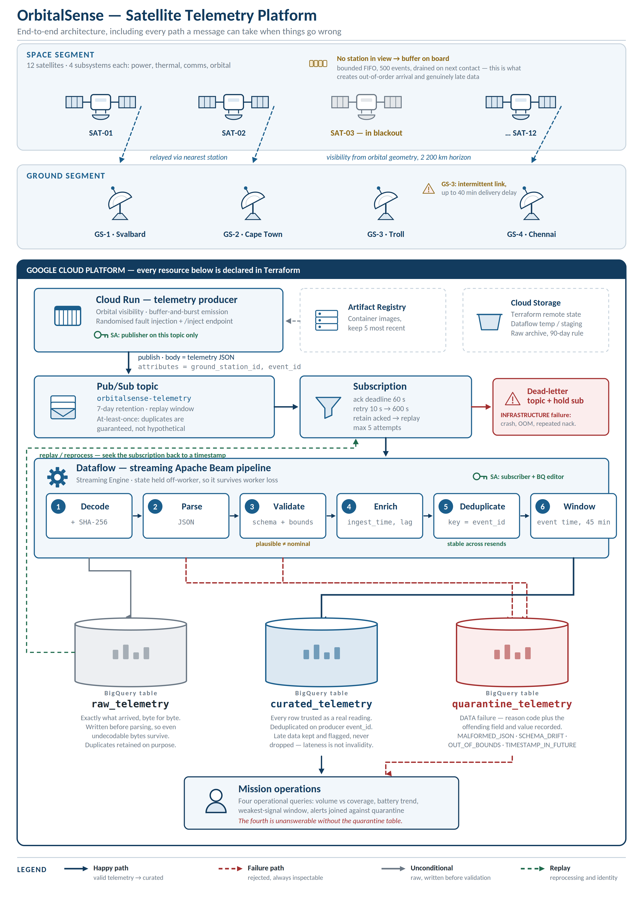
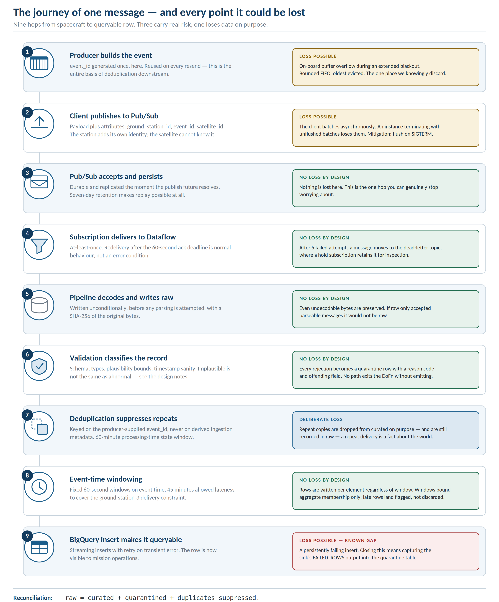

## Event contract

Message body (JSON):

    {
      "event_id": "uuid, generated once and reused on every resend",
      "satellite_id": "SAT-07",
      "subsystem": "power | thermal | comms | orbital",
      "sequence": 4821,
      "event_time": "ISO-8601 UTC",
      "producer_version": "0.1.0",
      "metrics": { "battery_voltage_v": 27.84 }
    }

Pub/Sub attributes: ground_station_id, satellite_id, event_id, schema_version.

The station identity travels as an attribute, not in the body, because the
satellite does not know which station heard it — the station does.

Visibility is computed geometrically: each satellite’s sub-satellite point is propagated from a circular-orbit model and compared against fixed ground-station coordinates using great-circle distance with a 2,200 km horizon. When more than one station is in view, the nearest wins — modelling a real scheduler’s link-budget preference. When no station is in view, telemetry is buffered on board (bounded FIFO, 500 events) and drained on the next contact.
Yes, this affects ordering, in three ways. First, buffer drains interleave old and new events, so arrival order does not match event order. Second, handovers move a satellite’s stream between publishers, and Pub/Sub only guarantees ordering within an ordering key for a single publisher — so even ordered publishing would not survive a handover. Third, ground-station relay latency differs per station, so two events emitted in order can overtake each other in flight.
We therefore treat arrival order as carrying no information. All correctness downstream is anchored to producer-supplied event_time and a stable event_id. We deliberately did not enable Pub/Sub message ordering: it would serialise delivery per key, cutting throughput and adding head-of-line blocking, to buy an ordering guarantee that a station handover breaks anyway. Event-time processing in Beam solves the real problem more cheaply.

## Deduplication: measured, not asserted

Before (pipeline_version 1.0.0-dev):
  21 events duplicated on the wire  →  42 rows in curated

After (pipeline_version 1.1.0-dedup):
  N events duplicated on the wire   →  N rows in curated

Raw retains all copies in both cases, deliberately: a repeat delivery is a fact
about the world, and raw's job is to record what arrived.

## Architecture

Failure paths are red, the unconditional write to raw is grey, replay is green.

## How a message travels

`raw = curated + quarantined + duplicates suppressed`.